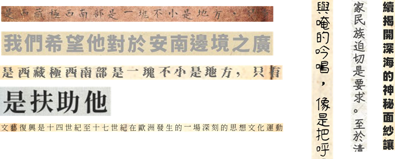

# OCR Synthesis Data Generator for Traditional Chinese

[](https://huggingface.co/datasets/ZihCiLin/traditional-chinese-ocr-synthetic)
[](LICENSE)

A configurable synthetic data generator for Traditional Chinese OCR, specifically designed for historical document recognition. This tool supports both horizontal and vertical text layouts, archaic character variants, and realistic visual degradation effects.


*Examples of generated synthetic images with both horizontal (left) and vertical (right) text layouts*

**Paper**: "Decoding-Time Fusion of OCR and Large Language Models for Traditional Chinese Historical Document Recognition"

## Key Features

- **Dual Orientation Support**: Generate both horizontal and vertical text layouts
- **Historical Document Simulation**
- **Extensive Character Coverage**: Supports 13,172 Traditional Chinese characters including archaic variants (CNS11643)
- **Smart Font Fallback**: Automatic font substitution ensures 100% character renderability
- **LMDB Export**: Direct conversion to LMDB format for fast training data loading
- **Flexible Configuration**: Customizable sentence length, character distribution, and visual appearance

## Dataset

We provide a pre-generated dataset of **4.1 million** synthetic image-text pairs:

- **Hugging Face**: [ZihCiLin/traditional-chinese-ocr-synthetic](https://huggingface.co/datasets/ZihCiLin/traditional-chinese-ocr-synthetic)
- **Splits**: Training set + two test sets (random sequences and semantic sentences)


## Installation

### Requirements

- Python 3.8+
- PIL (Pillow)
- LMDB (optional, for LMDB conversion)

### Setup

```bash
# Clone the repository
git clone https://github.com/Jason9339/ocr-synth-generator.git
cd ocr-synth-generator

# Install dependencies
pip install -r requirements.txt

# Verify font and background resources
python scripts/check_fonts.py
```

## Quick Start

### 1. Prepare Your Data

We provide a sample text file ([data/sample_lines.txt](data/sample_lines.txt)) with example sentences. You can also create your own text file with one sentence per line:

```
這是第一行範例文字
這是第二行範例文字
古籍文獻辨識研究
```

Place your font files in the `fonts/` directory and background textures in `backgrounds/`.

### 2. Generate Synthetic Images

```bash
# Horizontal layout
python3 src/synth.py \
    --lines data/sample_lines.txt \
    --fonts_dir fonts \
    --bgs_dir backgrounds \
    --out_dir output/horizontal \
    --manifest output/horizontal/manifest.jsonl \
    --n_per_line 5 \
    --last_resort_font NotoSansTC-Regular.ttf \
    --num_workers 6

# Vertical layout
python3 src/synth.py \
    --lines data/sample_lines.txt \
    --fonts_dir fonts \
    --bgs_dir backgrounds \
    --out_dir output/vertical \
    --manifest output/vertical/manifest.jsonl \
    --n_per_line 5 \
    --vertical \
    --last_resort_font NotoSansTC-Regular.ttf \
    --num_workers 6
```

### 3. Merge Manifests (for Batch Processing)

```bash
python3 src/merge_manifests.py --merge-both
```

### 4. Convert to LMDB (Optional)

```bash
python3 src/convert_to_lmdb.py \
    --src output/horizontal \
    --dst horizontal.lmdb \
    --verify
```

## Configuration

### Core Parameters

| Parameter | Description | Default |
|-----------|-------------|---------|
| `--lines` | Input text file (one line per sentence) | Required |
| `--fonts_dir` | Directory containing font files (.ttf, .otf) | `fonts` |
| `--bgs_dir` | Directory containing background images | `backgrounds` |
| `--out_dir` | Output directory for generated images | Required |
| `--n_per_line` | Number of images to generate per text line | `20` |
| `--vertical` | Generate vertical text layout | `False` |
| `--last_resort_font` | Fallback font for missing glyphs (must have full coverage) | Required |
| `--num_workers` | Number of parallel workers | `6` |
| `--seed` | Random seed for reproducibility | `42` |

### Visual Appearance

| Parameter | Description | Default |
|-----------|-------------|---------|
| `--box_jitter` | Bounding box jitter (width,height) in pixels | `0,0` |
| `--debug_boxes` | Draw debug bounding boxes | `False` |

See `python3 src/synth.py --help` for full parameter list.

## Output Format

### Manifest File (JSONL)

Each generated image produces a JSON line in the manifest:

```json
{
  "image_path": "output/horizontal/img_00001_0.jpg",
  "text": "這是範例文字",
  "orientation": "horizontal",
  "font": "NotoSerifTC-Bold.ttf",
  "font_size": 32,
  "background": "bg_paper_001.jpg"
}
```

### Directory Structure

```
output/
├── horizontal/
│   ├── img_00001_0.jpg
│   ├── img_00001_1.jpg
│   ├── ...
│   └── manifest.jsonl
└── vertical/
    ├── img_00001_0.jpg
    ├── ...
    └── manifest.jsonl
```

## Advanced Usage

### Customize Text Appearance

Edit parameters in [src/synth.py](src/synth.py):

```python
# Font size range
FONT_SIZE_RANGE = (26, 44)

# Text color (grayscale levels)
TEXT_GRAY_14 = ["#000000", "#141414", ..., "#F0F0F0"]

# Character spacing
HORIZ_CHAR_SPACING_RANGE = (0, 12)
VERT_CHAR_SPACING_RANGE = (0, 12)

# Blur effect
ENABLE_BLUR = True
BLUR_SIGMA_RANGE = (0.2, 0.9)
```

### Add Custom Fonts

1. Place `.ttf` or `.otf` files in `fonts/` directory
2. The generator automatically selects fonts randomly
3. Use `--last_resort_font` to specify fallback font for missing glyphs

### Add Background Textures

1. Place `.jpg` or `.png` images in `backgrounds/` directory
2. Backgrounds are randomly selected and applied with zoom jitter
3. Supports paper textures, aging effects, stains, etc.

## Tools

### `check_fonts.py`

Verify font coverage for your character set:

```bash
python3 scripts/check_fonts.py
```

### `merge_manifests.py`

Merge multiple batch manifests:

```bash
python3 src/merge_manifests.py --merge-both
```

### `convert_to_lmdb.py`

Convert generated data to LMDB format:

```bash
python3 src/convert_to_lmdb.py --src output/horizontal --dst output.lmdb --verify
```

## Related Resources

- **Synthetic Dataset**: [HuggingFace - traditional-chinese-ocr-synthetic](https://huggingface.co/datasets/ZihCiLin/traditional-chinese-ocr-synthetic)
- **Historical Document Benchmark**: [HuggingFace - traditional-chinese-historical-ocr-lo-chia-luen](https://huggingface.co/datasets/ZihCiLin/traditional-chinese-historical-ocr-lo-chia-luen)
- **Annotation System**: [document-ocr-annotation-system](https://github.com/Jason9339/document-ocr-annotation-system)

## Citation


## Troubleshooting

### Out of Memory

Reduce `--num_workers` or process smaller batches

### Missing Glyphs

Ensure `--last_resort_font` has comprehensive character coverage (e.g., Noto Sans TC)

## License

This project is licensed under the MIT License - see the [LICENSE](LICENSE) file for details.

## Acknowledgments

- **Lo Chia-Luen Collection**: Historical document samples from [NCCU Libraries Special Collection](https://da.lib.nccu.edu.tw/dp-1.html)
- **Fonts**: Noto Fonts and traditional Chinese typefaces
- **Background Textures**: Historical paper textures and degradation effects

## Contact

For questions or issues, please:
- Open an issue on GitHub
- Contact: 111703004@g.nccu.edu.tw

---

**Made for digital humanities and OCR research**
